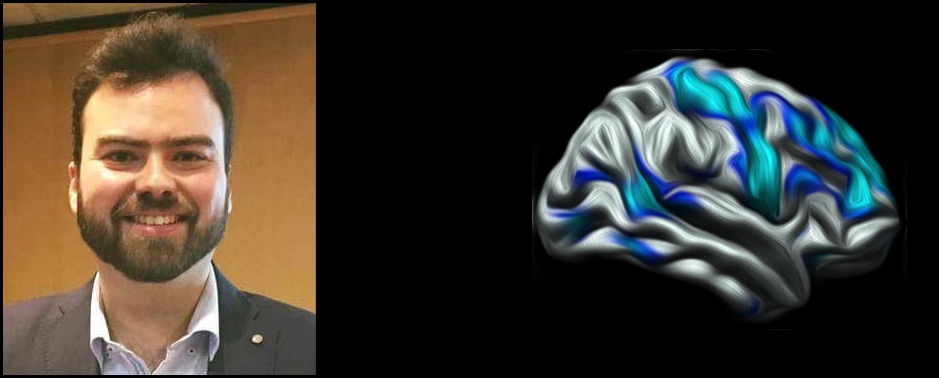

### Bio
I am Medical Doctor and a Neuroscience researcher with a position as *Researcher in Medical Sciences* at the National Institute of Psychiatry in Mexico City, Mexico. I also have a position as a *Visiting Fellow Researcher* at the University of Aarhus in Denmark.

### Research Interests
My research focuses on finding neuroimaging biomarkers in neuropsychiatric conditions that could be used for diagnosis or treatment evaluation. Currently, my main focus has been in Substance Addiction. 

### CV
[Education](educ.md)|[Publications](pub.md)|[Funding](fund.md)
--------------------|----------------------|------------------

